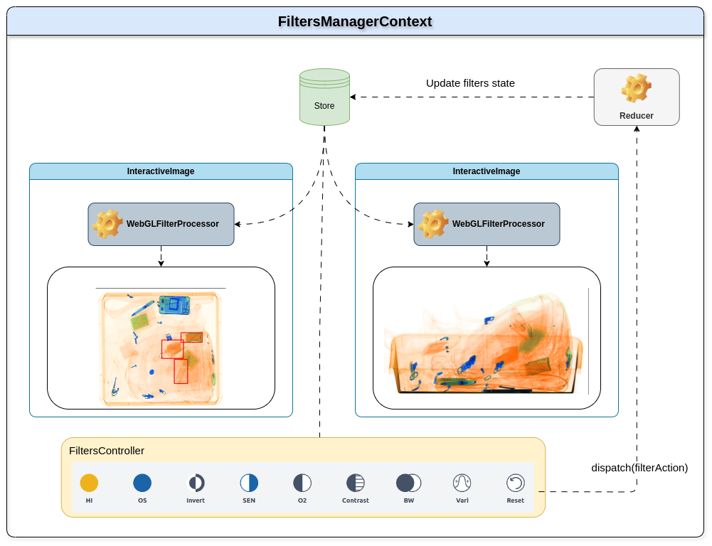

# XRAY 2.0 / Filters Management Design Document

- [Overview](#overview)
- [🎯 Design Goals and Objectives](#🎯-design-goals-and-objectives)
- [🎨 UI Design](#🎨-ui-design)
- [📝 Technical Design](#📝-technical-design)
- [🔬 Testing Plan](#🔬-testing-plan)
- [📋 Implementation Plan](#📋-implementation-plan)
- [Risks and Mitigation](#risks-and-mitigation)

## Overview
# XRAY 2.0 / Filters Management

| | |
|--------|-------|
| Owner  |    @LeviEyal   |
| Stakeholders  |    @LeviEyal, @yuvals @arit   |
| Goals  | Create the filters management of XRAY 2.0|
| Jira Tickets | [text](https://seetrue.atlassian.net/wiki/spaces/~62cfd521a94a6f9c0efef311/pages/edit-v2/458031105?draftShareId=7bbd6311-f971-4721-b476-5e27d0c0e6b4) |


This document describes the design of the Filters Management feature in XRAY 2.0.

The Filters Management feature allows users to apply various image filters to an input image using WebGL. The feature provides a set of predefined filters, such as color matrix transformations, convolution filters, contrast adjustments, edge detection, negative, inversion, sharpen, highPenetrationFilter, OS filter, O2 filter, and black and white conversion. Users can also create custom filters by combining multiple predefined filters in a sequence.

The feature is implemented as a library that provides a set of classes for applying image filters using WebGL in the browser. It consists of two main classes: `WebGLProgram` and `WebGLFilterProcessor`.

## 🎯 Design Goals and Objectives

The design goals and objectives for the Filters Management feature are as follows:

1. Provide a user-friendly interface for applying image filters.
2. Support a wide range of predefined filters for different image transformations.
3. Allow users to create custom filters by combining multiple predefined filters.
4. Optimize performance by utilizing WebGL for image processing.
5. Ensure cross-browser compatibility and responsiveness.


## 🎨 UI Design

### Filters Controller
<!-- Image -->

The Filters Controller is a user interface component that allows users to apply image filters to an input image. It consists of a list of predefined filters.

#### Slider
<!-- Image -->

Allows users to adjust the parameters of a filter. It consists of a slider control that allows users to change the value of a parameter.

#### VolumeMeter
<!-- Image -->

Allows users to adjust the volume of a filter. It consists of a volume control that allows users to change the volume of a filter.

## 📝 Technical Design


The Filters Management feature is implemented as a library that provides a set of classes for applying image filters using WebGL in the browser. The library consists of two main classes: `WebGLProgram` and `WebGLFilterProcessor`.

### WebGLProgram
The `WebGLProgram` class is responsible for creating and managing WebGL programs for applying image filters. It provides methods for compiling shaders, linking programs, setting uniforms, and rendering images.

### WebGLFilterProcessor (FilterProcessor)
The `WebGLFilterProcessor` class is responsible for applying image filters using WebGL.
#### Methods
```ts
interface FilterProcessor {
  addFilter(name: string, ...args: unknown[]): void;
  reset(): void;
  applyFilters(
    filters: FilterFunction[],
    image: HTMLImageElement
  ): HTMLCanvasElement;
  colorMatrix(matrix: number[]): void;
  contrast(amount: number): void;
  detectEdges(): void;
  highPenetrationFilter(): void;
  invert(): void;
  sharpen(): void;
  osFilter(): void;
  o2Filter(): void;
  blackWhite(): void;
  varAbsorption(amount: number): void;
}
```

## 🔬 Testing Plan
The Filters Management feature will be tested using the following methods:


## 📋 Implementation Plan

## Success metrics
- The feature is implemented according to the design specifications.
- The feature is tested and verified to work as expected.
- The feature is integrated into the XRAY 2.0 application.
- The feature is reviewed and approved by the stakeholders.
- Performance metrics are collected and analyzed to ensure optimal performance.
